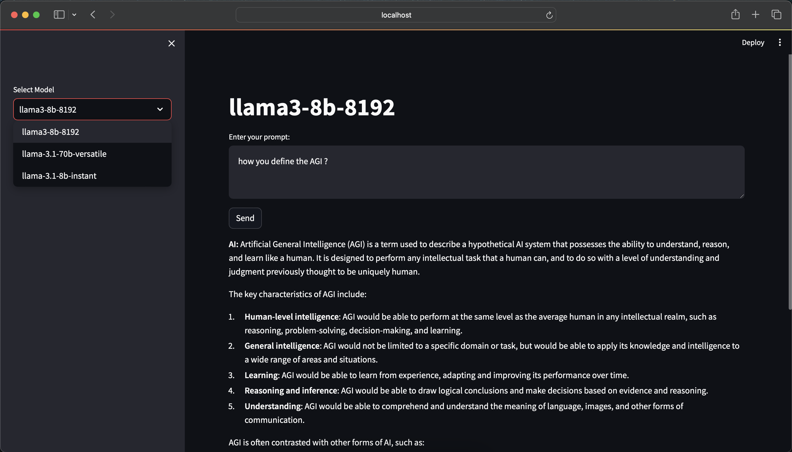

# Llama 3.1 AI Chat Interface

This repository contains a Streamlit-based chat interface utilizing the Llama 3.1 model through the Groq API. The app allows users to interact with different versions of the Llama 3.1 model and receive responses based on their prompts.



***You can try the live [application here](https://llama3-chat-interface.streamlit.app/).***


## Features

- **Model Selection:** Choose from different Llama 3.1 models.
- **Chat Interface:** Enter prompts and get responses from the selected model.
- **Error Handling:** Displays appropriate messages for errors or missing prompts.

## Setup

1. **Clone the Repository:**

   ```bash
   git clone https://github.com/your-username/your-repo-name.git
   cd your-repo-name
2. **Install Dependencies:**
    
    ```bash
    pip install -r requirements.txt
3. **Get Groq API Key:**

    Sign up for an account at [Groq](https://groq.com/) and obtain your API key. <br><br>

4. **Configure Environment Variables:**

    Create a `.env` file in the root directory of the project with the following content:

    ```bash
    GROQ_API_KEY=
5. **Run the Application:**

    Start the Streamlit app by running:

    ```bash
    streamlit run app.py

---

Readme made with 💖 using [README Generator by Chirag Joshi](https://github.com/chiragg-ai/)